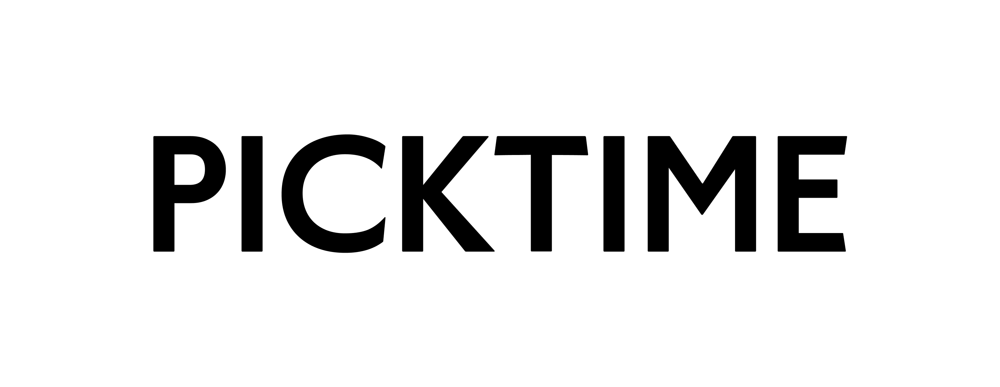

<div id="top"></div>

<!-- PROJECT LOGO -->
<br />
<div align="center">

[![Contributors][contributors-shield]][contributors-url]
[![Forks][forks-shield]][forks-url]
[![Stargazers][stars-shield]][stars-url]
[![Issues][issues-shield]][issues-url]
[![MIT License][license-shield]][license-url]

<!-- PROJECT LOGO -->
<br />
<div align="center">
  <a href="https://github.com/yuaanlin/pick-time.io">
    
  </a>

 <p align="center">
  <h3>📝 Schedule your time in at instant.</h3>
    <a href="https://gublight.com">View Demo</a>
    ·
    <a href="#bug">Report Bug</a>
    ·
    <a href="#pr">Contribute your code</a>
  </p>
</div>

<h1></h1>

<!-- TABLE OF CONTENTS -->
<details align='left'>
  <summary>Overview</summary>
  <ol>
    <li>
      <a href="#about-the-project">About The Project</a>
      <ul>
        <li><a href="#built-with">Built With</a></li>
        <li><a href="#using">Using</a></li>
      </ul>
    </li>
    <li>
      <a href="#getting-started">Getting Started</a>
      <ul>
        <li><a href="#prerequisites">Prerequisites</a></li>
        <li><a href="#installation">Installation</a></li>
      </ul>
    </li>
    <li><a href="#usage">Usage</a></li>
    <li><a href="#architecture-design-&-explanation">Architecture Design & Explanation</a></li>
    <li><a href="#a-little-more-detail">A Little More Detail</a></li>
    <li><a href="#license">License</a></li>
    
  </ol>
</details>

<br/>

<!-- ABOUT THE PROJECT -->
<div align='left'>

## 📌 About The Project


  ### Picktime is a tool that helps you easily schedule your event

- User-friendly interface on all devices.
  
- Minimal design
  
- Inspired by tha famous website [**When2meet**](https://www.when2meet.com)

<p align="right">(<a href="#top">back to top</a>)</p>

## 📌 Getting Started

> This is how you set up your project locally. To use picktime online, please visit [here](https://www.pick-time.io).

- ### Prerequisites

  we use pnpm as the node package manager, but feel free to use the one you like.
  - pnpm
    ```sh
    npm install pnpm -g
    ```

- ### Installation

  1. Clone the repo
     ```sh
     git clone https://github.com/yuaanlin/pick-time.io.git
     ```
     or

     ```sh
     git clone git@github.com:yuaanlin/pick-time.io.git
     ```
    
  2. Install Pnpm packages

  - pnpm
    ```sh
    pnpm install
    ```

  3. Start the development server

  - pnpm
    ```sh
    pnpm dev
    ```

  1. Enjoy `picktime` at http://localhost:3000

<p align="right">(<a href="#top">back to top</a>)</p>

<!-- USAGE EXAMPLES -->

## 📌 Usage
- ### Event creater
  -  Simply create your event by entering the title, possible dates and time.
  
  -  Share the RSVP link with your friend!
  
- ### Event attendant
  - Visit the event exclusive picktime link to scheduleyour availability.
  
  - Check other's availability anytime with a simple click !
  

<p align="right">(<a href="#top">back to top</a>)</p>


<!-- Bug-Report -->

<a id="bug"></a>
 ## [📌 Report a bug](https://github.com/yuaanlin/pick-time.io/issues)

- ### Please followw the below guidelines if you would like to report a bug:

  1. **Use the GitHub issue search** &mdash; check if the issue has already been
     reported.

  2. **Check if the issue has been fixed** &mdash; try to reproduce it using the
     latest `main` or development branch in the repository.

  3. **Isolate the problem** &mdash; create a [reduced test
     case](http://css-tricks.com/reduced-test-cases/) and a live example.


  Example:

  > Short and descriptive example bug report title
  >
  > A summary of the issue and the browser/OS environment in which it occurs. If
  > suitable, include the steps required to reproduce the bug.
  >
  > 1. This is the first step
  > 2. This is the second step
  > 3. Further steps, etc.
  >
  > `<url>` - a link to the reduced test case
  >
  > Any other information you want to share that is relevant to the issue being
  > reported. This might include the lines of code that you have identified as
  > causing the bug, and potential solutions (and your opinions on their
  > merits).

  
 <p align="right">(<a href="#top">back to top</a>)</p>

<!-- Contribute to the project -->
  
<a id="pr"></a>
## [📌 Contributing to Picktime](https://github.com/yuaanlin/pick-time.io/pulls)

-  ### Follow this process if you'd like your work considered for inclusion in the picktime

   1. [Fork](http://help.github.com/fork-a-repo/) the project, clone your fork,
      and configure the remotes:

      ```bash
      # Clone your fork of the repo into the current directory
      git clone https://github.com/yuuanlin/pick-time.io
      # Navigate to the newly cloned directory
      cd pick-time.io
      # Assign the original repo to a remote called "upstream"
      git remote add upstream https://github.com/yuuanlin/pick-time.io
      ```

   2. If you cloned a while ago, get the latest changes from upstream:

      ```bash
      git checkout <dev-branch>
      git pull upstream <dev-branch>
      ```

   3. Create a new topic branch (off the main project development branch) to
      contain your feature, change, or fix:

      ```bash
      git checkout -b <topic-branch-name>
      ```

   4. Commit your changes in logical chunks. Please adhere to these [git commit
      message guidelines](http://tbaggery.com/2008/04/19/a-note-about-git-commit-messages.html)
      or your code is unlikely be merged into the main project. Use Git's
      [interactive rebase](https://help.github.com/articles/interactive-rebase)
      feature to tidy up your commits before making them public.

   5. Locally merge (or rebase) the upstream development branch into your topic branch:

      ```bash
      git pull [--rebase] upstream <dev-branch>
      ```

   6. Push your topic branch up to your fork:

      ```bash
      git push origin <topic-branch-name>
      ```

   7. [Open a Pull Request](https://help.github.com/articles/using-pull-requests/)
       with a clear title and description.

    <br/>

    >  **IMPORTANT**: By submitting a patch, you agree to allow us to license your work under the same license as that used by `picktime`


  <!-- LICENSE-->

## 📌 License

- ### Picktime is distributed under the MIT License. See `LICENSE` for more information.

</div>

<p align="right">(<a href="#top">back to top</a>)</p>

<!-- MARKDOWN LINKS & IMAGES -->
<!-- https://www.markdownguide.org/basic-syntax/#reference-style-links -->

[contributors-shield]: https://img.shields.io/github/contributors/yuaanlin/pick-time.io.svg?style=for-the-badge
[contributors-url]: https://github.com/yuaanlin/pick-time.io/graphs/contributors
[forks-shield]: https://img.shields.io/github/forks/yuaanlin/pick-time.io.svg?style=for-the-badge
[forks-url]: https://github.com/yuaanlin/pick-time.io/network/members
[stars-shield]: https://img.shields.io/github/stars/yuaanlin/pick-time.io.svg?style=for-the-badge
[stars-url]: https://github.com/yuaanlin/pick-time.io/stargazers
[issues-shield]: https://img.shields.io/github/issues/yuaanlin/pick-time.io.svg?style=for-the-badge
[issues-url]: https://github.com/yuaanlin/pick-time.io/issues
[license-shield]: https://img.shields.io/github/license/yuaanlin/pick-time.io.svg?style=for-the-badge
[license-url]: https://github.com/yuaanlin/pick-time.io/blob/master/LICENSE
